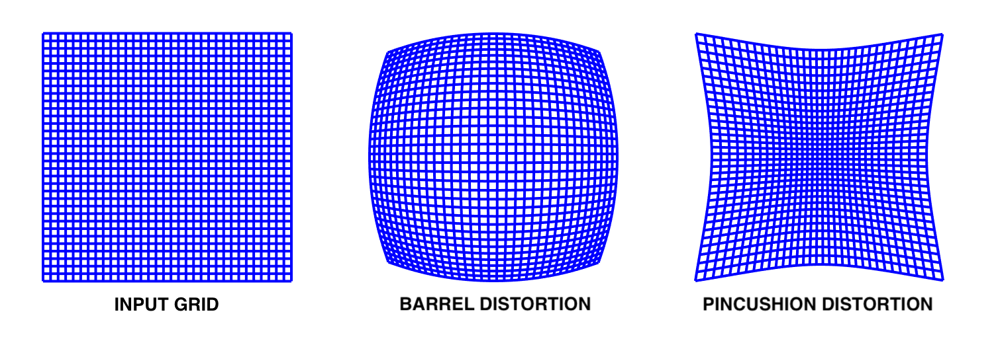

# LENS ANTI_DISTORTION
Аберрация - это искажение изображения, вызванное неправильной фокусировкой лучей света на оптической системе.
Существует множество разных типов аберраций, одним из которых является дисторсия.  Дисторсия - это искажение изображения, которое проявляется в том, что прямые линии на изображении могут выглядеть изогнутыми или искривленными. Дисторсия может быть бочкообразной или подушкообразной, в зависимости от направления искажения.

  
  

 Рисунок - Виды дисторсии (бочкообразность и подушкообразность) 
 
 

Мой проект направлен на решение проблемы дисторсии в изображениях с помощью алгоритма, который позволяет убирать или добавлять дисторсию. Данный алгоритм может быть полезен в различных областях, таких как обработка изображений и компьютерное зрение.

---
## Иформация о проекте:
Я реализовал процедуру избавления изображений от аберрации, запускающую интерактивное окно для подбора параметров искажений. Так же я добавил возможность самостоятельно вводить заранее известные значения параметров для реализации anti_distortion. 

При запуске кода будет предложен вариант работы в интерактивном окне, которое позволяет подбирать величины искажения по оси x и y для компенсации аберрации. После их подбора можно будет запустить код заново, уже точно указав интересующие значения x_distortion, y_distortion коэффициентов.  
Пример работы интерактивного режима:

  
  

 

>Пример работы скрипта с пояснениями можно посмотреть в файле jupiter notebook -
[__show_example.ipynb__](https://nbviewer.org/github/Koldim2001/Lens_distortion/blob/main/show_example.ipynb)  
>Все ключевые функции проекта находятся в файле [__functions.py__](https://github.com/Koldim2001/Lens_distortion/blob/main/functions.py)

По поводу коэффициентов:  Данный скрипт позволяет убирать как бочкообразную, так и подушкообразную дисторсии, просто меняя знак коэффициентов. 
Значения x_distortion, y_distortion со знаком минус говорят о том, что реализуется избавление исходного изображения от бочкообразности. Если исходное изображение подушкообразное, то необходимо ставить данные значения со знаком плюс.
Сами значения подбираемых коэффициентов обычно в диапазоне [-1, 1]
  
PS: Моя функция также может быть использована в том числе и для добавления аберрации на обычную фотографию для придания особого фотографического эффекта. При положительных коэффициентах получается бочкообразная дисторсия, а при отрицательных - подушкообразная

